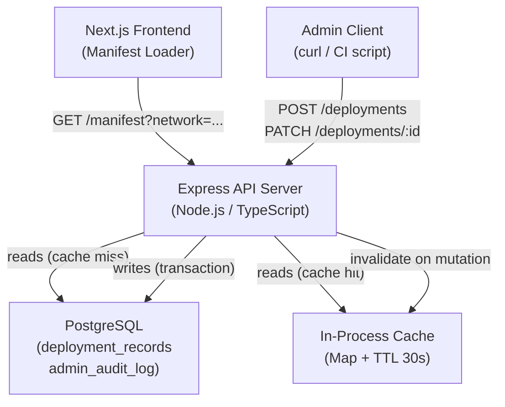

# Design Document: Deployment Registry

## Overview

The Deployment Registry replaces static `.env` files as the authoritative source of truth for Soroban contract addresses across environments. It consists of:

- A PostgreSQL schema with two tables: `deployment_records` and `admin_audit_log`
- An Express/Node.js HTTP API with four route groups: POST `/deployments`, PATCH `/deployments/:id`, GET `/deployments`, GET `/manifest`
- An admin authentication middleware (bearer token / API key via `Authorization` header)
- An in-process read cache with 30-second TTL, invalidated on mutations
- A Next.js manifest loader that fetches `/manifest` at build time or runtime

The registry is append-friendly: records are created and patched but never hard-deleted. The audit log is strictly append-only at the database permission level.

---

## Architecture



**Request lifecycle for mutations:**
1. Admin auth middleware validates `Authorization` header
2. Request body validator checks field formats (Strkey, SemVer, hex hash, network enum)
3. DB transaction: upsert `deployment_records` row + insert `admin_audit_log` row
4. On commit: invalidate in-process cache for the affected network
5. Return 201/200 with the updated record

**Request lifecycle for reads:**
1. No auth required
2. Check in-process cache; return cached response if fresh (< 30s)
3. On cache miss: query DB for `is_active = true` records for the requested network
4. Populate cache, set `Cache-Control: max-age=30`, return response

---

## Components and Interfaces

### Admin Auth Middleware

```typescript
// src/middleware/adminAuth.ts
export function adminAuth(req: Request, res: Response, next: NextFunction): void
```

- Reads `Authorization: Bearer <token>` header
- Compares token against `process.env.ADMIN_API_KEY` using a constant-time comparison
- Returns 401 if header is absent or malformed
- Returns 403 if token does not match (present but invalid)
- Applied only to `POST /deployments` and `PATCH /deployments/:id`

### TLS Enforcement Middleware

```typescript
// src/middleware/requireHttps.ts
export function requireHttps(req: Request, res: Response, next: NextFunction): void
```

- Active only when `NODE_ENV === 'production'`
- Checks `req.secure` or `X-Forwarded-Proto: https`
- Redirects plaintext requests with HTTP 301 to the HTTPS equivalent URL

### Input Validator

```typescript
// src/validators/deployment.ts
export function validateContractAddress(value: string): boolean
export function validateSemVer(value: string): boolean
export function validateWasmHash(value: string): boolean
export function validateNetwork(value: string): value is Network
export function validateCreateBody(body: unknown): CreateDeploymentDto
export function validatePatchBody(body: unknown): PatchDeploymentDto
```

- `validateContractAddress`: checks 56-char length, `C` prefix, and Strkey checksum via `@stellar/stellar-base`
- `validateSemVer`: uses the `semver` package's `valid()` function
- `validateWasmHash`: regex `/^[0-9a-f]{64}$/`
- `validateNetwork`: checks membership in `['mainnet', 'testnet', 'local']`
- Throws a typed `ValidationError` with field name and expected format on failure; route handlers catch and return HTTP 422

### Route Handlers

```typescript
// src/routes/deployments.ts
router.post('/', adminAuth, createDeployment)
router.patch('/:id', adminAuth, updateDeployment)
router.get('/', listActiveDeployments)

// src/routes/manifest.ts
router.get('/', getManifest)
```

### In-Process Cache

```typescript
// src/cache/deploymentCache.ts
interface CacheEntry { data: DeploymentRecord[]; expiresAt: number }
const store = new Map<Network, CacheEntry>()

export function getCached(network: Network): DeploymentRecord[] | null
export function setCached(network: Network, data: DeploymentRecord[]): void
export function invalidate(network: Network): void
```

- TTL is 30 seconds (`Date.now() + 30_000`)
- `invalidate` is called inside the mutation handler after the DB transaction commits
- No external dependency; suitable for single-process deployments

### Manifest Loader (Next.js)

```typescript
// frontend/src/lib/manifestLoader.ts
export interface ContractManifest {
  network: string
  contracts: Array<{
    contract_address: string
    semantic_version: string
    wasm_hash: string
    activated_at: string
  }>
}

export async function loadManifest(network: string): Promise<ContractManifest>
```

- Fetches `${NEXT_PUBLIC_REGISTRY_URL}/manifest?network=${network}`
- Used in Next.js Server Components or `getServerSideProps` for runtime fetching
- Can also be called in `next.config.mjs` for build-time embedding
- Throws on non-200 responses; caller handles fallback

---

## Data Models

### PostgreSQL Schema

```sql
-- Migration: 001_create_deployment_records.sql
CREATE TYPE network_enum AS ENUM ('mainnet', 'testnet', 'local');

CREATE TABLE deployment_records (
    id               SERIAL PRIMARY KEY,
    network          network_enum        NOT NULL,
    contract_address VARCHAR(56)         NOT NULL,
    semantic_version VARCHAR(64)         NOT NULL,
    wasm_hash        CHAR(64)            NOT NULL,
    activated_at     TIMESTAMPTZ         NOT NULL,
    is_active        BOOLEAN             NOT NULL DEFAULT true,
    created_at       TIMESTAMPTZ         NOT NULL DEFAULT NOW(),
    updated_at       TIMESTAMPTZ         NOT NULL DEFAULT NOW()
);

CREATE UNIQUE INDEX uq_network_address
    ON deployment_records (network, contract_address);

CREATE INDEX idx_network_active
    ON deployment_records (network, is_active);

-- Auto-update updated_at on row change
CREATE OR REPLACE FUNCTION set_updated_at()
RETURNS TRIGGER LANGUAGE plpgsql AS $$
BEGIN
    NEW.updated_at = NOW();
    RETURN NEW;
END;
$$;

CREATE TRIGGER trg_deployment_records_updated_at
    BEFORE UPDATE ON deployment_records
    FOR EACH ROW EXECUTE FUNCTION set_updated_at();
```

```sql
-- Migration: 002_create_admin_audit_log.sql
CREATE TABLE admin_audit_log (
    id                   SERIAL PRIMARY KEY,
    actor                VARCHAR(256)  NOT NULL,
    action               VARCHAR(16)   NOT NULL CHECK (action IN ('create', 'update')),
    target_id            INTEGER       NOT NULL REFERENCES deployment_records(id),
    change_payload_hash  CHAR(64)      NOT NULL,
    source_ip            VARCHAR(45)   NOT NULL,
    occurred_at          TIMESTAMPTZ   NOT NULL DEFAULT NOW()
);

-- Revoke mutation privileges to enforce append-only semantics
REVOKE UPDATE, DELETE ON admin_audit_log FROM PUBLIC;
REVOKE UPDATE, DELETE ON admin_audit_log FROM app_user; -- replace with actual role
```

### TypeScript Types

```typescript
// src/types.ts
export type Network = 'mainnet' | 'testnet' | 'local'

export interface DeploymentRecord {
  id: number
  network: Network
  contract_address: string
  semantic_version: string
  wasm_hash: string
  activated_at: string   // ISO 8601 UTC
  is_active: boolean
  created_at: string
  updated_at: string
}

export interface AuditLogRow {
  id: number
  actor: string
  action: 'create' | 'update'
  target_id: number
  change_payload_hash: string
  source_ip: string
  occurred_at: string
}

export interface CreateDeploymentDto {
  network: Network
  contract_address: string
  semantic_version: string
  wasm_hash: string
  activated_at: string
  is_active?: boolean
}

export interface PatchDeploymentDto {
  contract_address?: string
  semantic_version?: string
  wasm_hash?: string
  activated_at?: string
  is_active?: boolean
}
```

### Seed Migration

```sql
-- Migration: 003_seed_dev_data.sql
-- Skipped automatically when NODE_ENV=production (enforced in migration runner)
DO $$
BEGIN
  IF current_setting('app.environment', true) = 'production' THEN
    RAISE WARNING 'Seed migration skipped in production environment';
    RETURN;
  END IF;

  INSERT INTO deployment_records
    (network, contract_address, semantic_version, wasm_hash, activated_at, is_active)
  VALUES
    ('local',   'CAAAAAAAAAAAAAAAAAAAAAAAAAAAAAAAAAAAAAAAAAAAAAAAAAAAAAAA',
                '0.1.0', 'aabbcc' || repeat('0', 58), NOW(), true),
    ('testnet', 'CBBBBBBBBBBBBBBBBBBBBBBBBBBBBBBBBBBBBBBBBBBBBBBBBBBBBBBB',
                '0.1.0', 'ddeeff' || repeat('0', 58), NOW(), true)
  ON CONFLICT (network, contract_address) DO NOTHING;
END;
$$;
```

The migration runner checks `NODE_ENV` before executing file `003_seed_dev_data.sql` and skips it with a logged warning when `NODE_ENV === 'production'`.

---

## Correctness Properties

*A property is a characteristic or behavior that should hold true across all valid executions of a system — essentially, a formal statement about what the system should do. Properties serve as the bridge between human-readable specifications and machine-verifiable correctness guarantees.*

### Property 1: Unique constraint prevents duplicate (network, contract_address) pairs

*For any* two POST requests that share the same `network` and `contract_address`, the second request SHALL be rejected with HTTP 409, regardless of the other field values.

**Validates: Requirements 1.2, 3.6, 4.6**

---

### Property 2: Timestamps are set automatically on insert and update

*For any* inserted Deployment_Record, `created_at` and `updated_at` SHALL be set to the current UTC time. *For any* subsequent update to that record, `updated_at` SHALL be greater than or equal to its previous value and `created_at` SHALL remain unchanged.

**Validates: Requirements 1.4, 1.5**

---

### Property 3: Auth middleware rejects requests without valid admin credentials

*For any* request to a mutation endpoint (`POST /deployments`, `PATCH /deployments/:id`), if the `Authorization` header is absent the response SHALL be HTTP 401; if the header is present but the token does not match the configured admin key the response SHALL be HTTP 403.

**Validates: Requirements 2.1, 2.2, 2.3**

---

### Property 4: Strkey contract address validation

*For any* string submitted as `contract_address`, the validator SHALL accept it if and only if it is exactly 56 characters, begins with `C`, and passes Stellar Strkey checksum validation. Strings beginning with `G` (valid account addresses) SHALL be rejected even if otherwise well-formed.

**Validates: Requirements 3.2, 4.2, 8.1, 8.3**

---

### Property 5: SemVer validation rejects non-conforming version strings

*For any* string submitted as `semantic_version` that does not conform to SemVer 2.0, the validator SHALL reject the request with HTTP 422.

**Validates: Requirements 3.3, 4.3**

---

### Property 6: WASM hash validation rejects non-hex or wrong-length strings

*For any* string submitted as `wasm_hash` that is not exactly 64 lowercase hexadecimal characters, the validator SHALL reject the request with HTTP 422.

**Validates: Requirements 3.4, 4.4**

---

### Property 7: Network enum validation rejects unknown network values

*For any* string submitted as the `network` field or query parameter that is not one of `mainnet`, `testnet`, or `local`, the API SHALL return HTTP 422.

**Validates: Requirements 3.5, 6.2, 7.2**

---

### Property 8: POST creates a record and returns it

*For any* valid `CreateDeploymentDto`, a POST to `/deployments` SHALL return HTTP 201 and a response body whose fields match the submitted values (modulo server-assigned `id`, `created_at`, `updated_at`).

**Validates: Requirements 3.1**

---

### Property 9: PATCH applies only supplied fields

*For any* existing Deployment_Record and any valid `PatchDeploymentDto`, a PATCH to `/deployments/:id` SHALL return HTTP 200 and a response body where only the supplied fields differ from the pre-patch record; all other fields SHALL remain unchanged.

**Validates: Requirements 4.1**

---

### Property 10: Mutation atomically writes audit log row with all required fields

*For any* successful mutation (POST or PATCH), exactly one row SHALL be inserted into `admin_audit_log` within the same transaction, containing non-null values for `actor`, `action`, `target_id`, `change_payload_hash`, `source_ip`, and `occurred_at`. If the transaction rolls back, no audit row SHALL be persisted.

**Validates: Requirements 5.1, 5.2, 5.4**

---

### Property 11: Source IP recorded from X-Forwarded-For with fallback

*For any* mutation request, the `source_ip` stored in the audit log SHALL equal the first value in the `X-Forwarded-For` header when that header is present, and SHALL equal the TCP remote address when the header is absent.

**Validates: Requirements 5.5**

---

### Property 12: GET /deployments returns only active records for the requested network

*For any* network value in `{mainnet, testnet, local}`, a GET to `/deployments?network=<network>` SHALL return a JSON array containing exactly the Deployment_Records where `is_active = true` and `network` matches the query parameter — no records from other networks and no inactive records.

**Validates: Requirements 6.1**

---

### Property 13: Cache-Control header is present on read responses

*For any* successful GET `/deployments` or GET `/manifest` response, the `Cache-Control` header SHALL be present and SHALL include `max-age=30`.

**Validates: Requirements 6.4, 7.4**

---

### Property 14: Cache invalidation ensures post-mutation reads are fresh

*For any* network, after a successful mutation affecting that network, the next GET `/deployments?network=<network>` response SHALL reflect the mutated state (i.e., the in-process cache entry for that network SHALL have been invalidated).

**Validates: Requirements 6.5**

---

### Property 15: Manifest response shape is correct for all networks

*For any* valid network, a GET to `/manifest?network=<network>` SHALL return a JSON object with a `network` string field equal to the query parameter and a `contracts` array where each element contains `contract_address`, `semantic_version`, `wasm_hash`, and `activated_at`. When no active records exist, `contracts` SHALL be an empty array and the status SHALL be HTTP 200.

**Validates: Requirements 7.1, 7.5**

---

### Property 16: Seed migration is idempotent

*For any* number of times the seed migration is run in a non-production environment, the resulting `deployment_records` table SHALL contain exactly one row for `network = local` and one for `network = testnet` with the seed addresses — no duplicates.

**Validates: Requirements 9.3**

---

## Error Handling

| Scenario | HTTP Status | Response body |
|---|---|---|
| Missing/malformed `Authorization` header | 401 | `{ "error": "Unauthorized" }` |
| Valid header, wrong token | 403 | `{ "error": "Forbidden" }` |
| Invalid field value (address, version, hash, network) | 422 | `{ "error": "Validation failed", "field": "<name>", "message": "<detail>" }` |
| `(network, contract_address)` already exists | 409 | `{ "error": "Conflict", "message": "Deployment record already exists for this network and address" }` |
| Record `id` not found on PATCH | 404 | `{ "error": "Not found" }` |
| DB connection failure | 500 | `{ "error": "Internal server error" }` |
| Plaintext HTTP in production | 301 | Redirect to HTTPS equivalent |

All error responses set `Content-Type: application/json`.

The mutation handler wraps the DB transaction in a try/catch. On any DB error the transaction is rolled back (both the `deployment_records` write and the `admin_audit_log` write are undone). The route handler then maps the error to the appropriate HTTP status.

---

## Testing Strategy

### Dual Testing Approach

Both unit tests and property-based tests are required. They are complementary:

- **Unit tests** cover specific examples, integration points, and edge cases (e.g., the G-address rejection, the empty-contracts manifest, the production seed skip, the 301 redirect).
- **Property-based tests** verify universal invariants across randomly generated inputs (e.g., any invalid address is rejected, any valid POST round-trips correctly).

### Property-Based Testing Library

Use **`fast-check`** (TypeScript-native, works with Jest):

```bash
npm install --save-dev fast-check
```

Each property test runs a minimum of **100 iterations** (`{ numRuns: 100 }`).

Each test is tagged with a comment referencing the design property:

```typescript
// Feature: deployment-registry, Property 4: Strkey contract address validation
it('rejects non-C-prefix addresses', () => {
  fc.assert(
    fc.property(fc.string(), (addr) => {
      fc.pre(!isValidContractAddress(addr))
      expect(validateContractAddress(addr)).toBe(false)
    }),
    { numRuns: 100 }
  )
})
```

### Property Test Coverage

Each correctness property (1–16) SHALL be implemented by exactly one property-based test:

| Property | Test description |
|---|---|
| P1 | Duplicate (network, address) POST returns 409 |
| P2 | Inserted record has correct timestamps; update advances updated_at |
| P3 | Mutation endpoints return 401/403 for missing/invalid tokens |
| P4 | Strkey validator accepts only valid C-addresses, rejects G-addresses |
| P5 | SemVer validator rejects non-conforming version strings |
| P6 | Hash validator rejects non-64-char or non-lowercase-hex strings |
| P7 | Network validator rejects strings outside the enum |
| P8 | Valid POST returns 201 with matching record fields |
| P9 | PATCH only mutates supplied fields |
| P10 | Successful mutation always produces an audit row; rollback removes both |
| P11 | Audit log records correct source IP from header or fallback |
| P12 | GET /deployments returns only active records for the queried network |
| P13 | Cache-Control: max-age=30 present on all read responses |
| P14 | Post-mutation read reflects updated state |
| P15 | Manifest shape is correct; empty network returns empty contracts array |
| P16 | Seed migration is idempotent across multiple runs |

### Unit Test Coverage

- Admin auth middleware: missing header → 401, wrong token → 403, correct token → passes through
- TLS middleware: plaintext in production → 301, HTTPS in production → passes through, any in non-production → passes through
- G-address rejection (edge case of P4)
- Empty manifest response (edge case of P15)
- Seed skip in production (Requirement 9.2)
- Audit log DELETE/UPDATE rejection (Requirement 5.3)
- PATCH on non-existent ID → 404

### Integration Tests

A test PostgreSQL instance (via `pg` + Docker Compose or `testcontainers`) is used for:
- Transaction rollback atomicity (P10)
- Cache invalidation after mutation (P14)
- Seed idempotency (P16)
- Unique constraint enforcement (P1)
